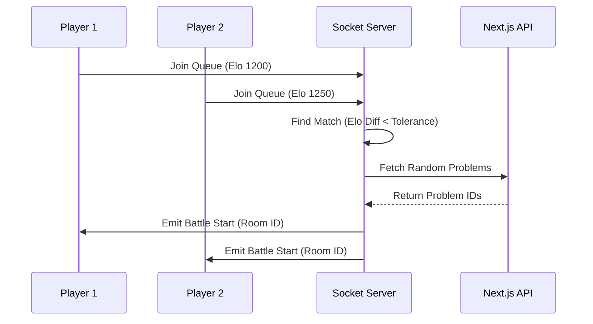
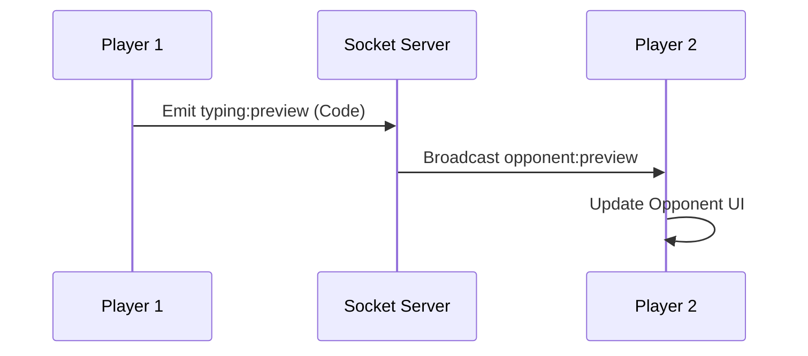
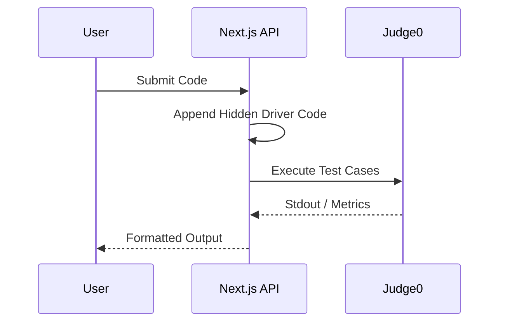
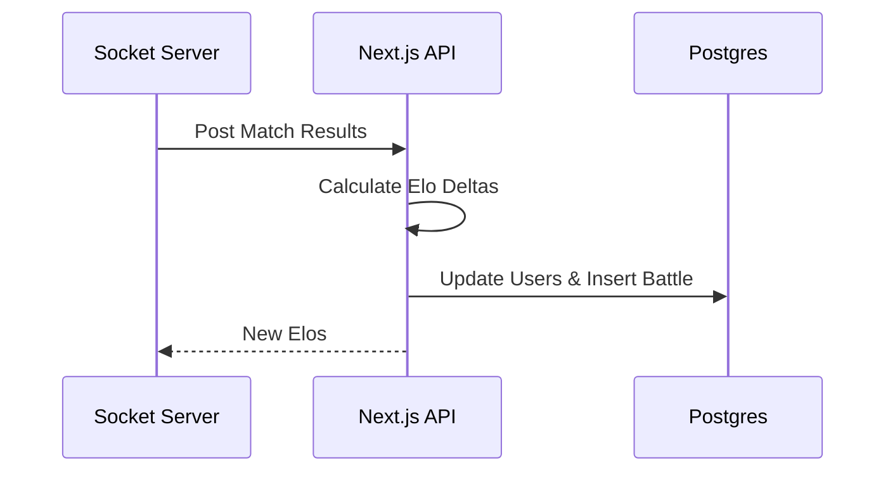

# Code Royale


---

## Description
Code Royale is a real-time, head-to-head coding arena where developers duel in live programming challenges. It solves the isolation of solo practice by matching you with similarly skilled opponents for competitive, split-screen coding battles. This platform is built for developers and competitive programmers looking to sharpen their skills under pressure.

---

## Live Deployment
You can play a live version of Code Royale here: **[code-royale-1v1.vercel.app](https://code-royale-git-main-suparnagrawals-projects.vercel.app/)**

> [!WARNING]
> **Live Deployment Constraints**
> The Vercel deployment linked above is currently configured to connect to backend services running directly on the **author's local laptop** (via ngrok tunnels). 
> 
> This means the matchmaking (Socket.io) and code execution (Judge0) features will **only work if the author's laptop is currently online and running the servers**. If the live link fails to connect, the backend services are offline.

---

## Features
- **Real-time Matchmaking**: Automatically queue and match with opponents based on Elo rating and game length.
- **Live Typing Sync**: See your opponent's code keystrokes in real-time as they type.
- **Elo Rating System**: Gain or lose points based on match outcomes to climb the competitive ladder.
- **Secure Authentication**: Email/password and Google OAuth supported via Better-Auth.
- **Code Execution Engine**: Safely run and test algorithmic solutions using a self-hosted Judge0 instance.
- **Intelligent Split Architecture**: High-frequency traffic is smartly routed to optimize performance. Real-time typing sync and matchmaking run entirely on the standalone Socket.io server, while intensive code compilation requests are completely offloaded to the isolated Judge0 execution engine. This deliberate separation keeps the core Next.js frontend lightweight, secure, and incredibly responsive.

---

## Tech Stack
- **TypeScript**: End-to-end type safety.
- **Next.js (App Router) & React**: Frontend UI and serverless API endpoints.
- **Node.js & Express & Socket.io**: Persistent backend server for realtime matchmaking.
- **PostgreSQL & Drizzle ORM**: Persistent data storage for users, sessions, and battles.
- **Better-Auth**: Flexible authentication and session management.
- **Judge0**: Remote code execution engine.
- **Tailwind CSS & shadcn/ui**: Styling and accessible UI components.

---

## Getting Started

### Prerequisites
You will need the following installed on your machine:
- [Node.js](https://nodejs.org/) (v18+)
- [Bun](https://bun.sh/) (for the socket server runtime)
- A PostgreSQL database (e.g., Neon)
- A running Judge0 instance (via Docker)

### Installation
Clone the repository and install the dependencies for both the web app and the socket server:

```bash
# Clone the repo
git clone https://github.com/yourusername/code-royale.git
cd code-royale

# Install frontend dependencies
bun install

# Install socket server dependencies
cd socket-server
bun install
```

### Environment Variables
Create a `.env` file in the root directory and a `.env` file in the `socket-server/` directory:

| Variable | Service | Description |
|---|---|---|
| `DATABASE_URL` | Web App | PostgreSQL connection string used by Drizzle |
| `BETTER_AUTH_URL` | Web App | Base URL used by better-auth for callbacks |
| `BETTER_AUTH_SECRET` | Web App | Secret key for generating session tokens |
| `GOOGLE_CLIENT_ID` | Web App | Google OAuth client ID for SSO |
| `GOOGLE_CLIENT_SECRET` | Web App | Google OAuth client secret for SSO |
| `NEXT_PUBLIC_SOCKET_URL` | Web App | URL pointing to your running socket server |
| `INTERNAL_API_KEY` | Web/Socket | Shared secret for internal user lookups and socket auth |
| `JUDGE0_URL` | Web App | URL of your self-hosted Judge0 instance |
| `NEXT_APP_URL` | Socket Server | Base URL of your Next.js frontend |

---

## Usage
Start both the Next.js web application and the Socket.io server to enable matchmaking and live typing sync.

```bash
# Start the Next.js frontend (from the root directory)
bun run dev

# Open a new terminal and start the socket server
cd socket-server
bun run src/index.ts
```

Once running, you can navigate to `http://localhost:3000`, log in, and enter the matchmaking queue.

---

## Project Structure
```text
.
├── app/                  # Next.js App Router pages and layouts
│   ├── api/              # API Route handlers (Auth, Execution, Internal logic)
│   ├── battlefield/      # Main real-time code editor interface
│   ├── controlBooth/     # Pre-match staging and matchmaking queue
│   ├── u/[username]/     # User profile and Elo progression chart
├── components/           # Reusable React components (UI, Auth, Battlefield)
├── lib/                  # Shared utilities and auth configuration
├── public/               # Static assets and icons
├── socket-server/        # Independent Express/Socket.io service
│   └── src/              # Matchmaking queues, active game state, and socket handlers
├── src/db/               # Drizzle ORM schemas and database client
└── drizzle.config.ts     # Configuration for database migrations
```

---

## API Reference
The Next.js application exposes a robust set of endpoints to handle authentication, code execution, and secure communication with the independent Socket server.

| Endpoint | Method | Payload / Parameters | Description |
|---|---|---|---|
| `/api/auth/*` | `GET/POST` | *Better Auth Internal* | Handles all authentication flows, callbacks, and session management. |
| `/api/execute` | `POST` | `code`, `languageId`, `testCases`, `problemId`, `runAll` | Securely forwards code to Judge0, appending the problem's driver code, and returns execution results. |
| `/api/socket-ticket` | `POST` | *None* | Generates a short-lived (60s) HMAC signed ticket for the frontend to securely authenticate with the socket server. |
| `/api/internal/user-info` | `GET` | `cookie` | Used exclusively by the socket server to validate session cookies and resolve a user ID. |
| `/api/internal/problem/random`| `GET` | `avgElo`, `count` | Internal endpoint fetching a specific number of random algorithmic problems matching the players' skill level. |
| `/api/internal/elo` | `POST` | `playerAId`, `playerBId`, `result`, `problemId`, `language`, `startedAt` | Processes post-match results, recalculates Elo, and inserts the battle record into the database. |

---

## Feature Workflows

### 1. Real-Time Matchmaking


### 2. Live Typing Sync


### 3. Code Execution


### 4. Post-Match Elo


---

## Acknowledgements
- [shadcn/ui](https://ui.shadcn.com/) for the beautiful UI components.
- [Judge0](https://judge0.com/) for the robust code execution engine.
- [Better-Auth](https://better-auth.com/) for the seamless authentication experience.
